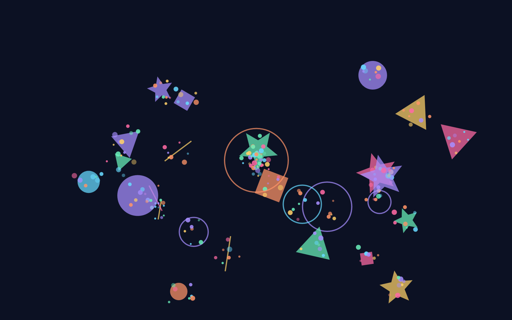
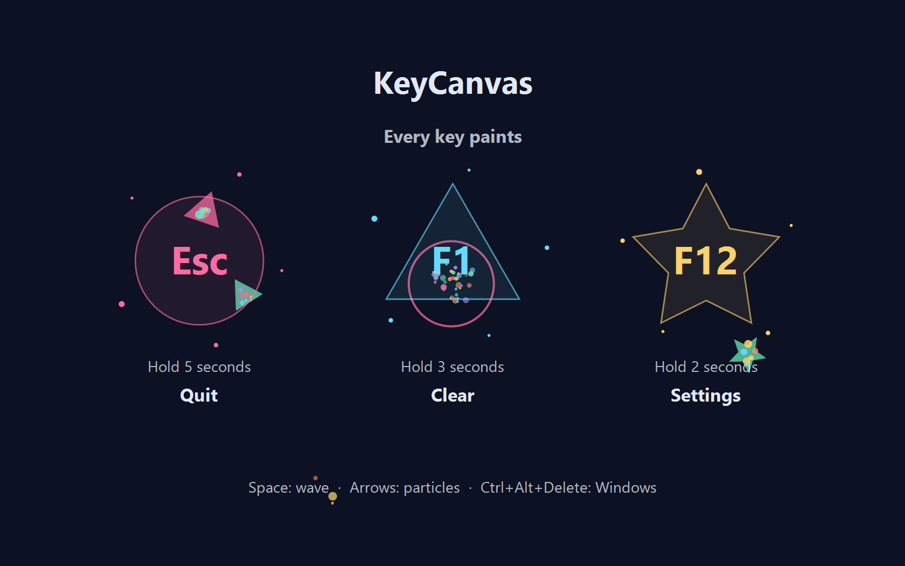
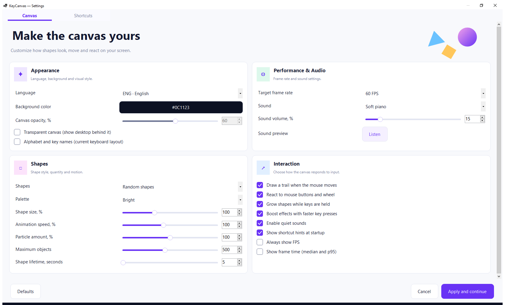
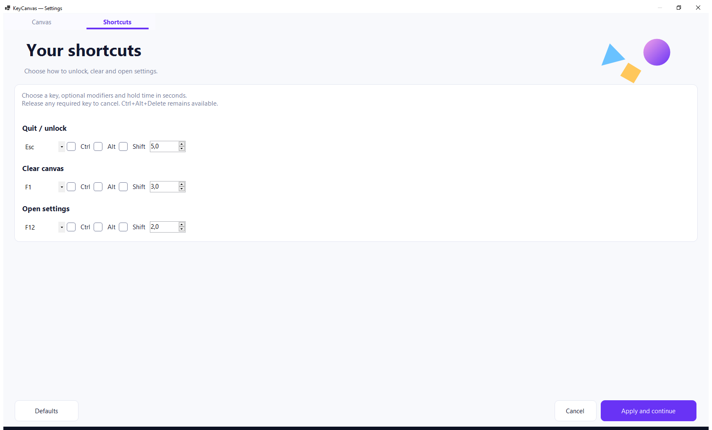

# KeyCanvas 1.2

[Russian README](README.ru.md)

**A full-screen canvas where each key press becomes a colorful shape.**
KeyCanvas fills the screen with shapes and particles when keys are pressed or
the mouse moves. Letters create animations instead of typed text.

Use it for:

- Supervised keyboard play when a child wants to press every button.
- Exploring colors, shapes and motion together.
- A short visual play session with no menus on the canvas.



## Download and start

Download **KeyCanvas-1.2.0-win-x64.zip** from the
[latest release](https://github.com/numbereleven-a/KeyCanvas/releases/latest),
extract it, and run `KeyCanvas.exe`. The portable build includes .NET.

Requires **Windows 10 version 1803 or newer, or Windows 11, on x64**.
The canvas covers all connected monitors, hides the cursor and blocks ordinary
system keyboard shortcuts while active. Use it with adult supervision.

## Controls

**Show shortcut hints at startup** is **on by default**. Large
shortcut hints appear at startup and fade out within **five seconds**.

| Input | Action |
| --- | --- |
| Any ordinary key | Create a colorful shape with particles |
| Hold a key | Grow its shape |
| Faster repeated presses | Stronger effects and a chain of shapes |
| Space | Create a wave at the center of the primary monitor |
| Arrow keys | Emit particles in that direction |
| Move, click or scroll the mouse | Draw a trail or create a burst |
| **Hold Esc for 5 seconds** | Quit |
| **Hold F1 for 3 seconds** | Clear the canvas with a fading animation |
| **Hold F12 for 2 seconds** | Open settings |
| **Ctrl+Alt+Delete** | Open the Windows security screen |

The corner rings show hold progress. Releasing Esc, F1 or F12 early cancels the
action. Repeat the action by releasing and holding the key again.

<details>
<summary>Startup shortcut hints</summary>



</details>

## Settings and languages



Settings are grouped into Appearance, Shapes, Performance & Audio, and
Interaction cards. Sliders and numeric fields stay synchronized. Cards stack
on narrow screens; Defaults, Cancel and Apply remain at the bottom.
Resize or maximize the settings window. It opens maximized when its scaled size
would exceed the display; the heading scrolls with the options to leave more room
on laptops with enlarged text or 200% display scaling.

Choose **ENG** or **RUS** directly in the menu. On first launch, Russian Windows
display language selects Russian; other Windows display languages select
English. The keyboard layout does not choose the application language.
Saved preferences take priority on later launches.

Settings include background color, seven shape choices, four palettes, size,
animation speed, particle amount, object limit, shape lifetime and a target of
30, 60, 90 or 120 FPS. Mouse effects, key-hold growth and rhythm effects can be
toggled separately.

Defaults: **500 objects**, **5-second shape lifetime**, **60 FPS target**.
Particles have shorter lifetimes. Old objects fade to keep the scene bounded.
Quiet **soft piano is enabled by default**, at **15% application volume**.
Choose piano, bells, xylophone or synthesizer (MIDI), or the original soft piano,
soft bells and soft xylophone. Adjust the volume, or uncheck
**Enable quiet sounds**. **Listen** previews the selected instrument.
MIDI instruments use the Windows General MIDI synthesizer. Multiple notes can sound
together; holding a key holds its note, and releasing it sends note-off.
Piano and percussion naturally decay even during a hold. Mouse clicks and
scrolling play short notes; movement remains silent. Instrument quality and
availability depend on the Windows MIDI output device. The original three soft
sounds use cached PCM audio and do not require MIDI. They play short notes,
with rapid presses replacing the previous note. The menu shares the canvas
MIDI output for previews and restores the chosen instrument after cancellation.

Enable **Alphabet and key names** to draw letters, numbers and key names
instead of keyboard shapes. Letters follow the current keyboard layout,
including Shift and Caps Lock, independently of the ENG/RUS menu language.
**Alt+Shift** cycles installed layouts on the canvas. Control keys such as
Space and Enter have labels; reserved adult action keys stay reserved.

Enable **Transparent canvas** to see the live desktop through the canvas.
**Canvas opacity** ranges from 10% to 100%; lower values reveal more of the
desktop. This affects both the background and drawings. Choose a black
background for dimming or another color for a tint. The canvas continues to
capture input; visibility does not allow clicks or typing into underlying apps.
Transparency and alphabet mode are disabled by default.

The **Shortcuts** tab configures quit/unlock, clear and settings separately:
choose a key, optional Ctrl/Alt/Shift modifiers, and a hold time from 0.5 to
10 seconds. For example, Ctrl+F1 can unlock the canvas. Hold the complete chord
for the selected duration; releasing any required key cancels the action.
Use different chords for each action. Startup hints show the saved shortcuts.
Ctrl+Alt+Delete remains available and cannot be assigned to an action.


**Always show FPS** keeps a counter on the canvas until disabled; it is **off by
default**. An independent frame-time option shows CPU median and p95 over the
last 120 processed frames. These measure application updates, not physical
monitor presentation; large translucent shapes can substantially reduce FPS.

Changing language translates the menu immediately. **Apply and continue**
saves all changes and returns to play. **Cancel**, Esc or Alt+F4 discards them.
Win, Alt+Tab, Alt+Esc and Ctrl+Esc remain blocked in settings and the color picker.
Preferences are stored in the current user's application-data folder. Native
Windows dialogs follow the Windows display language.

## Limits and recovery

KeyCanvas is a desktop application, not a locked-down Windows account or kiosk.
Ctrl+Alt+Delete remains available. Windows accessibility dialogs, touch edge
gestures and elevated applications can interrupt play. Do not run it as administrator.
Some touchpad drivers and system gestures switch windows without delivering
ordinary keyboard events to the canvas. If a gesture still escapes capture,
disable its window-switching action in Windows touchpad settings or the driver's
control panel. See [Windows gesture settings](https://support.microsoft.com/en-gb/windows/hardware/input-devices/touch-gestures-for-windows).

When the canvas loses focus, it releases keyboard capture and the cursor, and
moves behind the active window. Launching it again attempts to restore the
existing canvas or dialog instead of opening another instance.

If the UI stops responding for more than three seconds, keyboard input is
passed to Windows. Capture resumes after recovery. The hook is removed at exit;
Windows also removes it when the process terminates. The application does not
change Windows accessibility settings, accounts, startup entries or policies.

## Build and test

Use Windows and .NET SDK 10 with Windows Desktop support.

```powershell
dotnet build KeyCanvas.csproj -c Release
dotnet run --project tests/KeyCanvas.Tests.csproj -c Release
dotnet publish KeyCanvas.csproj -c Release -r win-x64 --self-contained true -p:PublishSingleFile=true -p:IncludeNativeLibrariesForSelfExtract=true -o artifacts/1.2.0/release/win-x64
```

Optional checks:

```powershell
dotnet run --project tests/KeyCanvas.Tests.csproj -c Release -- --menu-check
dotnet run --project tests/KeyCanvas.Tests.csproj -c Release -- --dpi-check
dotnet run --project tests/KeyCanvas.Tests.csproj -c Release -- --new-modes-check
dotnet run --project tests/KeyCanvas.Tests.csproj -c Release -- --release-check artifacts/1.2.0/release/win-x64/KeyCanvas.exe
dotnet run --project tests/KeyCanvas.Tests.csproj -c Release -- --benchmark
dotnet run --project tests/KeyCanvas.Tests.csproj -c Release -- --window-benchmark
dotnet run --project tests/KeyCanvas.Tests.csproj -c Release -- --screenshots docs/images
```

Menu, release and screenshot checks temporarily open windows and send synthetic
keyboard input; do not switch windows while they run. The regular checks install
a disabled hook and do not capture desktop input. Benchmark results are CPU
measurements and do not measure monitor refresh or two physical displays.

Manually verify Ctrl+Alt+Delete recovery, accessibility dialogs, mixed-DPI
monitors and touch behavior on the target device. Release builds omit debug
symbols and replace source build paths with a stable prefix.

## License

[MIT](LICENSE).
