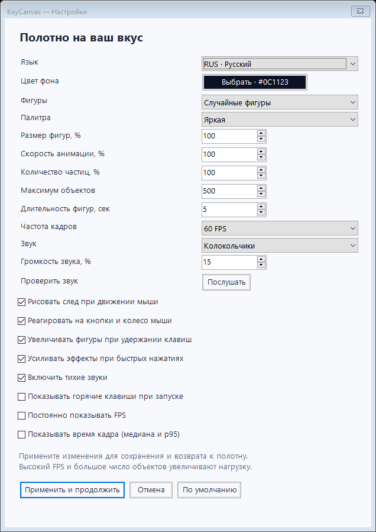

# KeyCanvas 1.0

[English README](README.md)

**Полноэкранный холст, где каждое нажатие превращается в цветную фигуру.**
KeyCanvas открывает полноэкранное полотно: нажатия клавиш и движения мыши
создают фигуры и частицы. Буквы превращаются в анимацию, а не вводятся как текст.

Программа подойдёт для:

- Игры под присмотром взрослого, когда ребёнок хочет нажимать все кнопки.
- Совместного знакомства с цветами, фигурами и движением.
- Короткой визуальной игры без меню на детском полотне.

## Скачать и запустить

Скачайте **KeyCanvas-1.0.0-win-x64.zip** из
[последнего релиза](https://github.com/numbereleven-a/KeyCanvas/releases/latest),
распакуйте архив и запустите `KeyCanvas.exe`. Устанавливать .NET отдельно не нужно.

Нужна **Windows 10 версии 1803 или новее либо Windows 11, x64**.
Полотно занимает все мониторы, скрывает курсор и перехватывает обычные системные
сочетания клавиш. Используйте программу под присмотром взрослого.

## Управление

Опция **«Показывать горячие клавиши при запуске»** по умолчанию **выключена**.
Если её включить, крупные подсказки появятся на полотне при запуске
и плавно исчезнут в течение **пяти секунд**.

| Действие | Результат |
| --- | --- |
| Любая обычная клавиша | Цветная фигура с частицами |
| Удержание клавиши | Фигура растёт |
| Быстрые повторные нажатия | Более сильные эффекты и цепочка фигур |
| Пробел | Волна из центра основного монитора |
| Стрелки | Поток частиц в выбранную сторону |
| Движение, кнопки и колесо мыши | Цветной след или всплеск |
| **Esc — держать 5 секунд** | Выход |
| **F1 — держать 3 секунды** | Очистка с растворением фигур |
| **F12 — держать 2 секунды** | Меню настроек |
| **Ctrl+Alt+Delete** | Системный экран Windows |

Кольца в углу показывают прогресс удержания. Отпускание Esc, F1 или F12 раньше
срока отменяет действие. Для повтора отпустите клавишу и удерживайте снова.

## Настройки и язык

Язык переключается прямо в меню: **ENG / RUS**. При первом запуске на русской
Windows выбирается русский, на остальных языках Windows — английский.
Учитывается язык интерфейса Windows, а не раскладка клавиатуры.
При следующих запусках приоритет имеет сохранённый выбор.

Можно менять фон, фигуры, палитру, размер, скорость анимации, количество частиц,
лимит объектов, время жизни фигур и целевую частоту 30/60/90/120 FPS.
След мыши, реакции на кнопки, рост при удержании и усиление от ритма
включаются отдельно.

По умолчанию: **500 объектов**, **5 секунд жизни фигур**, **цель 60 FPS**.
Частицы исчезают быстрее; старые объекты постепенно убираются.

По умолчанию включены **тихие колокольчики**, громкость приложения — **15%**.
Можно выбрать мягкое пианино, колокольчики или ксилофон, изменить громкость
либо снять флажок **«Включить тихие звуки»**. Кнопка **«Послушать»** воспроизводит
выбранный тембр. Звуки реагируют на новые нажатия клавиш, кнопки и колесо мыши,
а не на непрерывное движение или удержание. Быстрые нажатия заменяют предыдущую
ноту; частота воспроизведения ограничена, чтобы звуки не накапливались в очереди.

Опция **«Постоянно показывать FPS»** оставляет счётчик на полотне до отключения;
по умолчанию она **выключена**. Отдельно можно включить медиану и p95 времени
обработки последних 120 кадров. Это частота обновлений программы, а не измерение
физического вывода на монитор. Большие полупрозрачные фигуры снижают FPS.

Язык меню меняется сразу. **«Применить и продолжить»** сохраняет все изменения
и возвращает игру. **«Отмена»**, Esc или Alt+F4 закрывают меню без сохранения.
Win, Alt+Tab, Alt+Esc и Ctrl+Esc остаются заблокированы в меню и выборе цвета.
Настройки хранятся в пользовательском каталоге данных приложения.
Стандартные диалоги Windows используют язык самой Windows.

## Ограничения и восстановление

Это обычное приложение, а не полностью заблокированный компьютер.
Ctrl+Alt+Delete остаётся доступным. Системные окна специальных возможностей,
сенсорные жесты от края экрана и приложения с повышенными правами могут
прервать игру. Не запускайте программу от администратора.

При потере фокуса возвращаются клавиатура и курсор, а полотно располагается
позади активного окна. Повторный запуск пытается вернуть уже открытое окно.
Если интерфейс не отвечает больше трёх секунд, ввод передаётся Windows;
после восстановления перехват возобновляется. При выходе hook снимается;
при завершении процесса Windows также освобождает его.

Программа не меняет настройки доступности, учётные записи, автозапуск
и системные политики Windows.

## Сборка и лицензия

Нужны Windows и .NET SDK 10 с поддержкой Windows Desktop.
Команды сборки и проверок приведены в [английском README](README.md#build-and-test).
На своём устройстве отдельно проверьте возврат с Ctrl+Alt+Delete, специальные
возможности, мониторы с разным масштабом и сенсорные жесты.

Лицензия [MIT](LICENSE).
